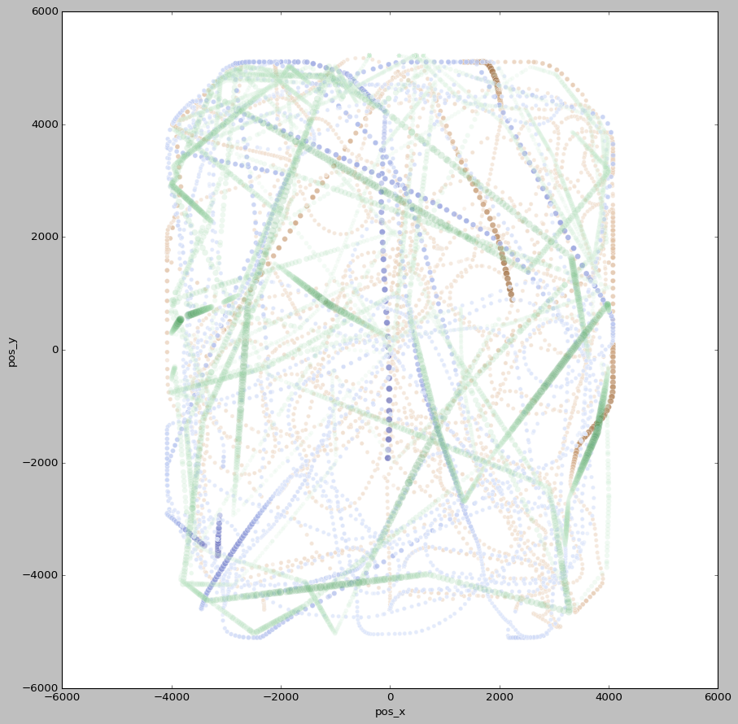

# COM-480 Data Visualization Project - Team VataDiz - Milestone 1

# DataSet

[Rocket League Championship Series 2021-2022](https://www.kaggle.com/datasets/dylanmonfret/rlcs-202122), found on Kaggle.
This is data generated during the Rocket League Championship Series (RLCS, professional level), season 2021/2022, in all regions. 
It presents 6 ready-to-use `.csv` documents aggregating statistics on Rocket League `.replay` files crossed with information tracking websites data such as [octane.gg](https://octane.gg/) or [ballchasing.com](https://ballchasing.com/). The `.replay` files are compiled documents generated after each game of Rocket League. They can be analyzed with the open-source [carball](https://github.com/SaltieRL/carball) python library made by SaltieRL. All the data is available in open access using @Can'tFly APIs.

# Problematic

## Context
Rocket League is a widely known multiplayer-competitive-sport video game developed by Psyonix. Two teams are opposed in a game of soccer played with rocket-powered acrobatic cars for a minimum of 5 minutes. Players control their car’s rigid body to interact physically with the ball and attempt scoring. They manifest their playstyle through the mastery of tricks such as jumps, flips, rotations, drifts, and rocket propulsion. The team that scores the most wins a single game. In case of a tie after 5 minutes, both teams play indefinitely until one of them scores. In competitive play, each team is composed of 3 players and the victory of a single match follows the format of Best-Of (BO) 3/5/7 games (first team to win 2/3/4 games in total). Strategy can evolve during the rounds, and across rounds. During a Championship, the first phase is a round-robin qualification where each team plays against several other teams to get points and be qualified for the next phase. The second phase is a regular bracket championship where each loss is eliminatory.

## Problems

The goal of the project is to visualize how players change their play behavior knowing the seasonal factors. Specifically, we would like to picture whether they tempt to play more or less aggressively/risky depending on:

* Are they the favorite team? I.e, in the current analyzed local championship, will the team with the lowest ranking will take more or less risk to contest the favorite team?
* Are they winning the Best-of? I.e, let's take for example a B-O 5 where team A has won 2 of the 3 rounds it needs to win to be qualified. Will team A play more defensively in order to keep their advance, or will they try to continue to pressure the opposing team?
* Is there a global difference in risk-taking knowing that it is the championship’s first or second phase? I.e, if the loss is eliminatory, will the players change the way they play to adjust to the stakes?

Using this 3-axes analysis (what is more natural for a 3-D game!), the goal is to have a comprehension of how each team adapts to the situation during the championships. Even though the project focuses on Rocket League, the same analysis may be carried out on other team sports. An interesting follow-up would be to compare the obtained results with other “ball” sports, such as Soccer, Hockey, or Volley-Ball for example.

Finally, the basis for these analyses is embodied by the Rocket League Championship games dataset proposed on Kaggle. Since the goal is to analyze players’ behaviors and strategies in times of pressure and adversity, we chose to focus on top-tier games. Indeed, it is way more probable that professional players would adopt what they think is the optimal strategy and apply it rigorously compared to amateurs. Playstyle can vary from one world region to the other and since established rankings are not worldwide, we might not be able to determine global team “favoritism” accurately.

# Exploratory Data Analysis

The `.replay` files, once processed using Carball, contain valuable insights, such as the time series of the position of each player and the ball.
From this, one can extract the trajectories that are plotted in the following figure (only 2 players and the ball for clarity): 

The blue dots correspond to the ball trajectory and the brown and green dots correspond to two players from opposing teams. From this data, one can easily compute the time spent by each player in a specific playing field region, and therefore establish a metric to compute the "risk-taking" aspect of each player. Once this metric is established and tested, one can evaluate and compare the result of this metric on different games and establish the possible differences between each scenario described in **Problem**.  

  
This is a plot showing the sum of time spent by all 3 players of a team in the opponent's half, by region. Some regions have integrated the professional circuit recently and are thus considered "underdogs", in the sense that they're almost never favorite when facing a team from a "major" region (North America and Europe). We could then expect them to try and play more aggressively, or at least, spend more time in their opponent's half.

  
This plot shows different statistics for core stats from all the teams in the dataset. This could be used and/or combined with other statistics to define a metric representing risk or some strategies.

  
These two histograms show how much teams spent time in the offensive half (i.e. the opponent side) depending on whether the game was won or not.

# Related Work

We will distinguish related works into two categories: data visualization on Rocket Leagues games and player's behavior research in other domains.

We previously mentioned [octane.gg](https://octane.gg/) and [ballchasing.com](https://ballchasing.com/) as the holders of `.replay` data or complementary tournament statistics. Moreover, they offer a large panel of visualization directly on their website. 

On [ballchasing.com](https://ballchasing.com/), not only we can find information about the pro players, but we can also look for any uploaded game by the community.

Showcase of [ballchasing.com](https://ballchasing.com/) visualizations for a randomly chosen professional game:

On [octane.gg](https://octane.gg/), you will find everything you need in the professional world of Rocket League:

Some machine learning work has been done with the data, by the author of the Dataset. The provided code is an attempt to predict matches outcomes during a given event. This can be found [here](https://www.kaggle.com/code/dylanmonfret/rlcs-prediction-na-winter-regional-3).

Various members of the community used this data or part of this data to show interesting findings. Examples can be found [here](https://www.reddit.com/r/RocketLeagueEsports/comments/s2jrrj/some_analysis_on_the_correlation_between_winning/) or [there](https://www.reddit.com/r/RocketLeagueEsports/comments/twr7pe/fall_format_vs_winter_format_simulations_stats/).

As most work that has been done before mainly focuses on core, basic stats such as goal percentage or score per game, we wanted to push the analysis further and try to visualize risk management and strategy, which are statistics that are not directly visible in-game. This allows us to understand and visualize the player/team's behaviors.

It is hard to properly track extremely relevant research, but these behavioral analyses have also been conducted in other sports such as soccer. In this [paper](https://www.tandfonline.com/doi/full/10.1080/02640414.2016.1169309)  by Javier Fernandez-Navarro et al., it has been shown that it is possible to use 19 different indicators to predict and analyze attacking and defensive style of play of players. 
